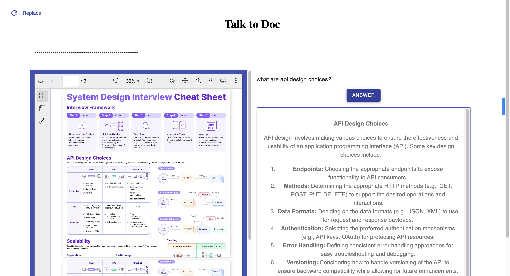

# Talk to Doc
#### Try out the live demo of the app: [Talk to Doc Live Demo](http://talktodoc.s3-website-us-east-1.amazonaws.com/)


Talk to Doc is a React-based web application that allows users to upload PDF documents, ask questions about the content of the document, and receive automated responses generated using OpenAI's GPT-3.5 Turbo model. Users can also input their OpenAI API key to interact with the app.




## Features

- PDF Upload and Viewer
- Natural Language Query Input
- Automated Response Generation using GPT-3.5 Turbo
- OpenAI API Key Input for personalized usage

## Getting Started

Follow these steps to get the project up and running on your local machine for development and testing purposes. See the [Deployment](#deployment) section for a guide on how to deploy the project on a live system.


### Prerequisites

- Node.js installed on your machine
- OpenAI API key (for GPT-3.5 Turbo)

### Installation

1. Clone the repository
   ```bash
   git clone https://github.com/your-username/talk-to-doc.git
   cd talk-to-doc
   ```
2. Install dependencies
   ```bash
   npm install
   ```
3. Create a `.env` file in the root directory and add your OpenAI API key
   ```plaintext
   REACT_APP_OPENAI_API_KEY=your-api-key-here
   ```
4. Start the development server
   ```bash
   npm start
   ```

Now, open [http://localhost:3000](http://localhost:3000) in your browser to use the app.

### Usage Tips

- Upload a PDF document by clicking on the "Upload PDF" button.
- Once the document is uploaded, you'll see a PDF viewer on the left and a query input box on the right.
- Enter your question related to the document content in the input box.
- Click the "Answer" button to get a response.
- If it's your first time using the app, you'll need to enter your OpenAI API key in the "Enter Key" input field.

## Contributing

Feel free to fork the repository, create a feature branch, and send us a pull request. For bugs, questions, and discussions please use the [Github Issues](https://github.com/your-username/talk-to-doc/issues).

## License

This project is licensed under the MIT License. See the [LICENSE](LICENSE) file for details.


